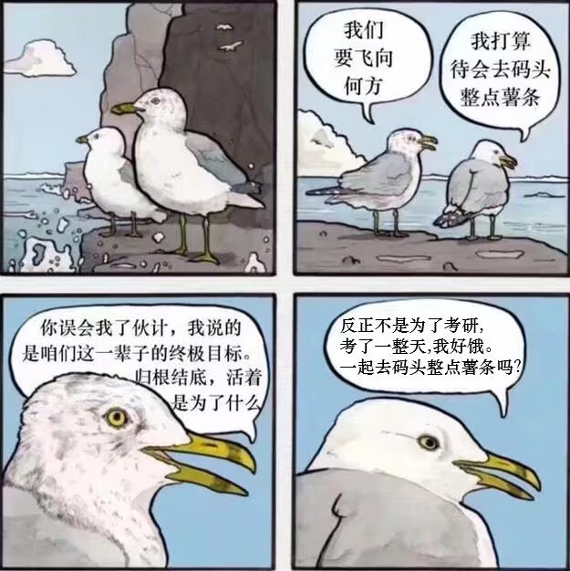

💗榨💗干💗单💗词💗
#### 描述
本项目旨在帮助英语苦手们通过研究生入学考试。🪝8️⃣红宝书单词太多了,🐭🐭我啊真的要4️⃣了🤏
于是🐭🐭突发奇想能不能只背考试出现过的呢?
如果能够只背未来考试卷上出现的就更好了🤌

虽然市面上有很多单词书,和背单词的软件,但他们或多或少都有些令🐭🐭不满意的地方.比如一些使用了艾宾浩斯
曲线的背单词软件,对于一些单词的复习次数实在是太多了,常常是单词软件刷了好久,一看卷子又懵逼了.

而很多所谓的重点单词书,也不能保证真的是重点单词质量不一鱼龙混杂.
于是🐭🐭写了这么一个简单的代码,可以通过导入txt的方式对词频进行分析排序,同时可以自由安排时间和复习速度.(大概)

#### 考研时在做什么？有没有空？可以来拯救吗? 

毕竟不是真的做金山词霸.所以功能简陋,扎不多得了💦.本想用Qt做个界面的,但转念一想,正经人谁用gui啊,🪝8️⃣有时间写代码不如多背几个单词.随缘更新

better to run than curse the road. 与其感慨路难行，不如马上出发.

#### 感谢 OTZ
本项目使用OCRmyPDF获取ocr版本的原始数据。作者的github是https://github.com/ocrmypdf/OCRmyPDF

本项目使用的离线英语词典。作者的github是https://github.com/mahavivo/english-dictionary

#### 搞点薯条

